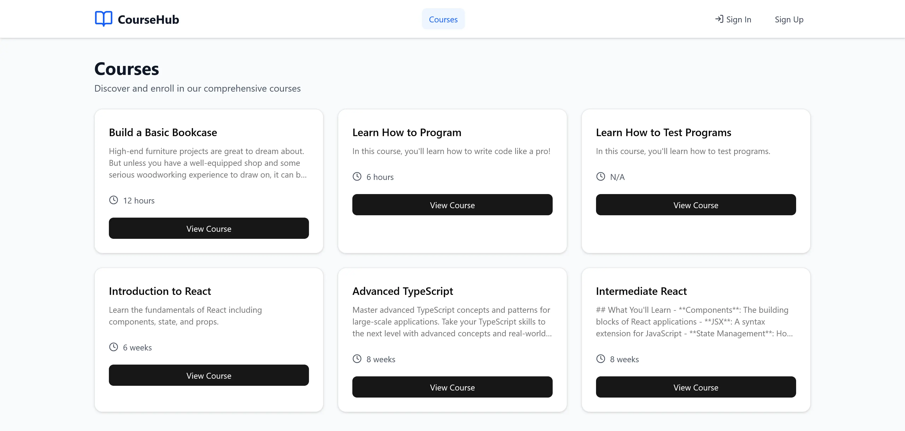
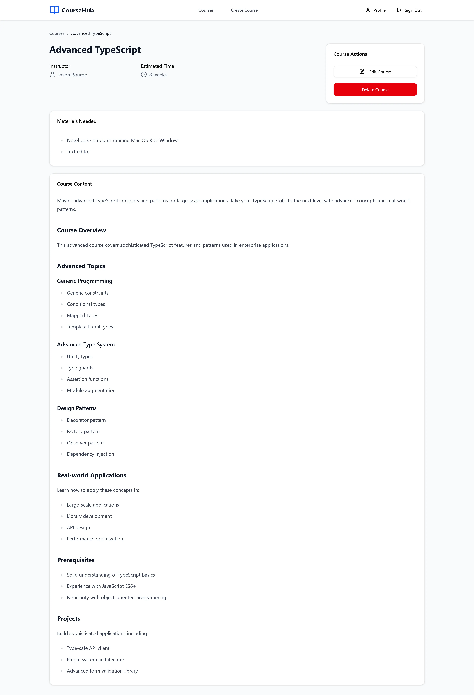
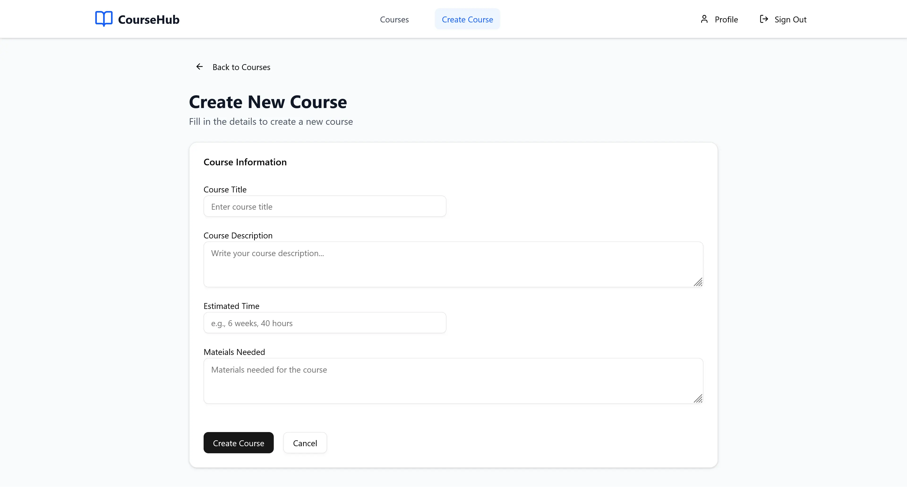

# 📚 Course Manager Frontend (Rebuilt with React + TypeScript)

A sleek and modern **frontend client** for the [Course REST API](../backend/README.md), originally developed as part of the [Treehouse Full-Stack JavaScript Techdegree](https://teamtreehouse.com/techdegree/full-stack-javascript).
This version is a **complete rebuild from scratch**, keeping the project mostly the same, but updating it to use **TypeScript**, **TailwindCSS**, **Shadcn/UI**, **Axios**.

## 📷 Screenshots

## ✨ Tech Stack

- ⚛️ **React**
- 🟦 **TypeScript**
- 🎨 **TailwindCSS** + **Shadcn/UI**
- 🔗 **Axios** (for API communication)
- 🧾 **React Hook Form and Zod** (for forms & validation)
- 📝 **React Markdown** (for rendering course descriptions)
- 🔄 **React Router** (for routing and navigation)
- 🔒 **Basic Auth** (matching backend authentication)

## 🧠 Features

- 👤 **User Authentication**

  - Sign up and sign in using Basic Auth (username/password)
  - Authenticated routes and protected actions

- 📘 **Course Management**

  - View all available courses
  - View course details with Markdown-rendered descriptions
  - Create, update, and delete courses (if you are the owner)

- 💅 **Modern UI/UX**

  - Built with TailwindCSS and Shadcn/UI for elegant, responsive design
  - Reusable UI components and accessible forms

- 🧼 **Clean, Typed Codebase**
  - Fully typed with TypeScript for reliability and developer experience
  - Modular architecture with reusable hooks, components, and utilities

## 🧪 API Integration

This frontend consumes the backend API endpoints from the [Course REST API (Hono + Drizzle)](../backend/README.md):

| Method   | Endpoint        | Used In                      |
| -------- | --------------- | ---------------------------- |
| `GET`    | `/courses`      | Home page (list all courses) |
| `GET`    | `/courses/:id`  | Course detail view           |
| `POST`   | `/courses`      | Create course form           |
| `PUT`    | `/courses/:id`  | Update course form           |
| `DELETE` | `/courses/:id`  | Delete course button         |
| `POST`   | `/users`        | Sign-up form                 |
| `GET`    | `/users` (auth) | Sign-in verification         |

## 🧠 What I Learned

### 1. **Modern React with TypeScript** ⚛️

I learned to structure a scalable React project with full TypeScript support — including reusable component types, props, and API response interfaces.

### 2. **Form Management with React Hook Form** 🧾

Creating forms for sign-up, sign-in, and course creation taught me how to manage validation, error handling, and controlled inputs efficiently.

### 3. **TailwindCSS + Shadcn/UI** 🎨

Building with TailwindCSS and Shadcn/UI helped me understand how to quickly prototype elegant, responsive UIs while maintaining design consistency and accessibility.

### 4. **API Communication with Axios** 🔗

I practiced managing authenticated API requests with Basic Auth headers, handling responses and errors gracefully, and syncing frontend state with backend data.

### 5. **Rendering Markdown** 📝

Using React Markdown for course descriptions was a fun challenge — I learned to safely render Markdown and style it consistently across the app.

## 💡 Future Improvements

- Better Authentication: Use an established auth library or Token-based authentication (JWT)
- Allow users to update and delete their profile/account
- Pagination and filtering for course list

## 🙏 Acknowledgments

- Huge thanks to [Treehouse](https://teamtreehouse.com/) and their Full-Stack JavaScript Techdegree program for laying the foundation of this project.
